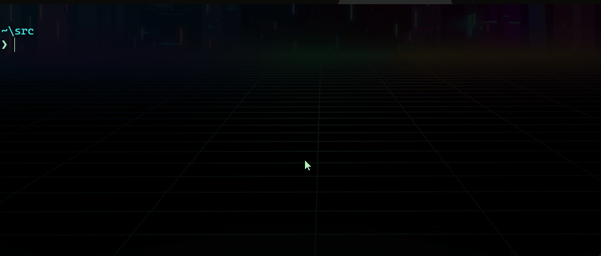

# Dumputils Container

 [](https://github.com/st3ga/dumputils-container/actions/workflows/build.yml)   

 **`🚀 blazingly-usefull! Please contribute if you have anything to add!`**



Table of Contents
=================

<!--ts-->
 * **[What is it](<#what-is-it>)**  
 * **[What's inside](<#whats-inside>)**  
    *  **[Tools](<#tools>)**  
    *  **[Aliases](doc/ALIASES.md)**
    *  **[Helper Scripts](doc/HELPERS.md)**
 * **[Usage](#usage)**  
    *  **[Run](#run)**  
    *  **[Build](#build)**  
 * **[Examples](#examples)**
    * **[Backup PostgreSQL and upload to S3](<#backup-postgresql-and-upload-to-s3>)**
    * **[Use your existing credentials](<#use-your-existing-credentials>)**
    * **[Run inside Kubernetes](<#run-inside-kubernetes>)**
<!--te-->

## What is it

This container provides easy access to most backup/restore utils for managing database backups. Additional aliases and help scripts has been added. It aims to solve the problem of installing different versions of tools and their dependencies on your local machine or server. It presents you with a structured shell environment where you can make your backup/restore procedures manually or automate with scripts while running inside Docker Compose or Kubernetes.

## What's inside

### Tools

- **PostgreSQL Client Tools Version: 11, 12, 13, 14 and 15**
    - **[psql](https://www.postgresql.org/docs/15/app-psql.html)**
    - **[pg_dump](https://www.postgresql.org/docs/current/app-pgdump.html)**
    - **[pg_dumpall](https://www.postgresql.org/docs/current/app-pg-dumpall.html)**
    - **[pg_restore](https://www.postgresql.org/docs/current/app-pgrestore.html)**

- **Mongo tools version 100.5.2**
    - **[mongodump](https://www.mongodb.com/docs/database-tools/mongodump/)**
    - **[mongoexport](https://www.mongodb.com/docs/database-tools/mongoexport/)**
    - **[mongofiles](https://www.mongodb.com/docs/database-tools/mongofiles/)**
    - **[mongoimport](https://www.mongodb.com/docs/database-tools/mongoimport/)**
    - **[mongorestore](https://www.mongodb.com/docs/database-tools/mongorestore/)**
    - **[mongostat](https://www.mongodb.com/docs/database-tools/mongostat/)**
    - **[mongotop](https://www.mongodb.com/docs/database-tools/mongotop/)**

- **MariaDB Client Tools version 10.8**
    - **[mysql](https://mariadb.com/kb/en/mysql-command-line-client/)**
    - **[mysql_find_rows](https://mariadb.com/kb/en/mysql_find_rows/)**
    - **[mysql_fix_extensions](https://mariadb.com/kb/en/mysql_fix_extensions/)**
    - **[mysql_waitpid](https://mariadb.com/kb/en/mysql_find_rows/)**
    - **[mysqlaccess](https://mariadb.com/kb/en/mysqlaccess/)**
    - **[mysqladmin](https://mariadb.com/kb/en/mysqladmin/)**
    - **[mysqlanalyze](https://www.commandlinux.com/man-page/man1/mysqlanalyze.1.html)**
    - **[mysqlcheck](https://mariadb.com/kb/en/mysqlcheck/)**
    - **[mysqldump](https://mariadb.com/kb/en/mariadb-dumpmysqldump/)**
    - **[mysqlimport](https://mariadb.com/kb/en/mysqldumpslow/)**
    - **[mysqlrepair](https://www.commandlinux.com/man-page/man1/mysqlrepair.1.html)**
    - **[mysqlreport](https://mariadb.com/kb/en/mysqlreport/)**
    - **[mysqlshow](https://mariadb.com/kb/en/mysqlshow/)**
    - **[mysqlslap](https://mariadb.com/kb/en/mysqlslap/)**

- **[kubectl](https://kubernetes.io/docs/reference/kubectl/) latest stable version**
- **[MinIO Client](https://min.io/docs/minio/linux/reference/minio-mc.html) latest stable version**
- **[AWS cli](https://aws.amazon.com/cli/) latest stable version**
- **[Redis cli](https://redis.io/docs/manual/cli/) latest stable version**
- **[bat](https://github.com/sharkdp/bat) v0.22.1 for Syntax highlighting**
- **net-utils, curl, wget**
- **zip, unzip, tar, etc .. for archiving**
- **aliases and nice shell prompt**
- **shell utils (tmux, bat, htop)**
- **How To common tricks**

## Usage

### Run

The prebuild images are pushed to Github (ghcr.io) and Dockerhub (docker.io). You can use whatever meets your expectations to run the image as follows:

`The latest tag is stable and suitable for use. It reflects to the latest release`

- **Github Registry**

```bash
docker run --rm --name dumputils \
-h dumputils -v /opt/backups:/opt/backups \
-it ghcr.io/st3ga/dumputils:latest
```

- **Docker Registry**

```bash
docker run --rm --name dumputils \
-h dumputils -v /opt/backups:/opt/backups \
-it st3ga/dumputils:latest
```

To run specific release version of your choice just use the desired release tag:

- **Run version 1.1.0**

```bash
docker run --rm --name dumputils \
-h dumputils -v /opt/backups:/opt/backups \
-it st3ga/dumputils:1.1.0
```

### Build

For restricted environments the image can be build with the above commands. Please note that the main branch is considered unstable. Use the latest release tag.

```bash
git clone https://github.com/st3ga/dumputils-container.git
git checkout v1.1.0
docker build -f Dockerfile -t registry.yourdomain.com/dumputils:1.1.0 .
```

## Examples

### Backup PostgreSQL and upload to S3

Using the container to do manual backup of database called `sales` inside PostgreSQL Server Version 12 running in `192.168.1.5:5432`. Upload to AWS s3 bucket called `test` after

```bash
user@machine: mkdir -p /opt/backups
user@machine: docker run --rm --name dumputils -h dumputils -v /opt/backups:/opt/backups -it st3ga/dumputils:latest

[root@dumputils] cd /opt/backups/ && export PGPASSWORD="<password>" && pg_dump12 -h 192.168.1.5 -p 5432 -U <user> -F t sales > sales.tar
[root@dumputils] export AWS_ACCESS_KEY_ID=<key-id> && export AWS_SECRET_ACCESS_KEY=<acces-key>
[root@dumputils] aws s3 cp sales.tar s3://test/backups/
```

You can find the tar file in /opt/backups inside your host machine after you exit the container.

### Use your existing credentials

```bash
docker run --rm --name dumputils -h dumputils \
-v /opt/backups:/opt/backups \
-v $HOME/.config/kube:/root/.config/kube \
-v $HOME/.aws/:/root/.aws \
-v $HOME/.azure:/root/.azure \
-it st3ga/dumputils:latest
```

### Run inside Kubernetes

- Deploy the stack

You can increase the volume size of your data mounted in /opt/backups to match your needs. The default value is 5 Gigs which is suitable only for small backups and test purposes. You can entairly remove the Persistence Volume Claim if you plan to directly upload your backup right after it is created. 

```bash
kubectl apply -f examples/k8s/deployment/ 
```

- Validate 

```bash
kubectl get all -n dumputils

NAME                             READY   STATUS    RESTARTS   AGE
pod/dumputils-5db9795564-ct87j   1/1     Running   0          1m

NAME                        READY   UP-TO-DATE   AVAILABLE   AGE
deployment.apps/dumputils   1/1     1            1           1m

NAME                                   DESIRED   CURRENT   READY   AGE
replicaset.apps/dumputils-5db9795564   1         1         1       1m

kubectl get pvc -n dumputils

NAME                STATUS   VOLUME    CAPACITY   ACCESS MODES   STORAGECLASS   AGE
dumputils-storage   Bound    pvc-xxx   5Gi        RWO            local-path     1m
```

- Use 

From now on you can use your dumputils instance by starting a shell with the following commands

```bash
kubectl exec -it \
$(kubectl get pods --template '{{range .items}}{{.metadata.name}}{{end}}' --selector=app=dumputils -n dumputils) \
-n dumputils -- /bin/bash

-----------------------------------------------------------------------------------------------

      ██████╗ ██╗   ██╗███╗   ███╗██████╗       ██╗   ██╗████████╗██╗██╗     ███████╗
      ██╔══██╗██║   ██║████╗ ████║██╔══██╗      ██║   ██║╚══██╔══╝██║██║     ██╔════╝
      ██║  ██║██║   ██║██╔████╔██║██████╔╝█████╗██║   ██║   ██║   ██║██║     ███████╗
      ██║  ██║██║   ██║██║╚██╔╝██║██╔═══╝ ╚════╝██║   ██║   ██║   ██║██║     ╚════██║
      ██████╔╝╚██████╔╝██║ ╚═╝ ██║██║           ╚██████╔╝   ██║   ██║███████╗███████║
      ╚═════╝  ╚═════╝ ╚═╝     ╚═╝╚═╝            ╚═════╝    ╚═╝   ╚═╝╚══════╝╚══════╝

┌─[root@dumputils]─[~]
└──╼ #
```
