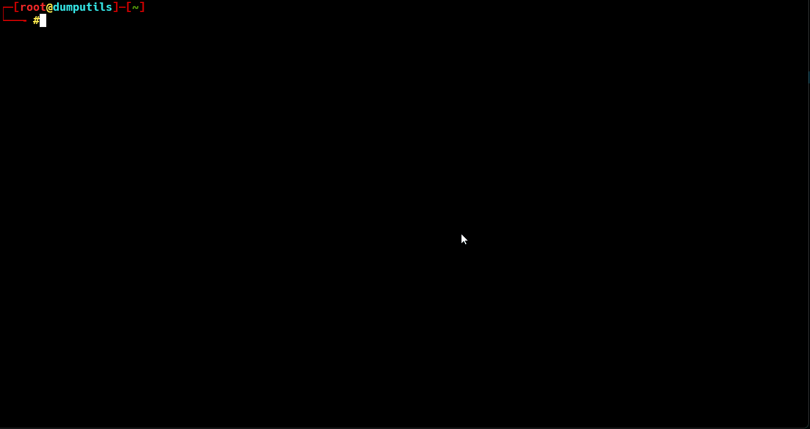

### Aliases

This container provides the following bash aliases

- **Shell**

| Alias           |         Destination                                             |
|-----------------|:---------------------------------------------------------------:|
| rm              |  rm -i                                                          |
| cp              |  cp -i                                                          |
| mv              |  mv -i                                                          |
| cd.             |  cd ..                                                          |
| cd..            |  cd ../..                                                       |
| cd...           |  cd ../../..                                                    |
| cat             |  bat -pp                                                        |
| extract         |  function which recognise the archieve format and extracts it   |
| aliases         |  show this document                                             |

- **Kubectl**

| Alias           |         Destination                        |
|-----------------|:------------------------------------------:|
| kc              |  kubectl                                   |
| kclsp           |  kubectl get pods -A -o wide               |
| kclsn           |  kubectl get nodes -o wide                 |
| kclss           |  kubectl get services -A                   |

- **PG Tools**

| Alias           |         Destination                        |
|-----------------|:------------------------------------------:|
| pg_dump10       |  /usr/lib/postgresql/10/bin/pg_dump        |
| pg_dump11       |  /usr/lib/postgresql/11/bin/pg_dump        |
| pg_dump12       |  /usr/lib/postgresql/12/bin/pg_dump        |
| pg_dump13       |  /usr/lib/postgresql/13/bin/pg_dump        |
| pg_dump14       |  /usr/lib/postgresql/14/bin/pg_dump        |
| pg_dump15       |  /usr/lib/postgresql/15/bin/pg_dump        |
| pg_restore10    |  /usr/lib/postgresql/10/bin/pg_restore     |
| pg_restore11    |  /usr/lib/postgresql/11/bin/pg_restore     |
| pg_restore12    |  /usr/lib/postgresql/12/bin/pg_restore     |
| pg_restore13    |  /usr/lib/postgresql/13/bin/pg_restore     |
| pg_restore14    |  /usr/lib/postgresql/14/bin/pg_restore     |
| pg_restore15    |  /usr/lib/postgresql/15/bin/pg_restore     |
| pg_dumpall10    |  /usr/lib/postgresql/10/bin/pg_dumpall     |
| pg_dumpall11    |  /usr/lib/postgresql/11/bin/pg_dumpall     |
| pg_dumpall12    |  /usr/lib/postgresql/12/bin/pg_dumpall     |
| pg_dumpall13    |  /usr/lib/postgresql/13/bin/pg_dumpall     |
| pg_dumpall14    |  /usr/lib/postgresql/14/bin/pg_dumpall     |
| pg_dumpall15    |  /usr/lib/postgresql/15/bin/pg_dumpall     |
| p_copy          |  /usr/bin/timescaledb-parallel-copy        |

